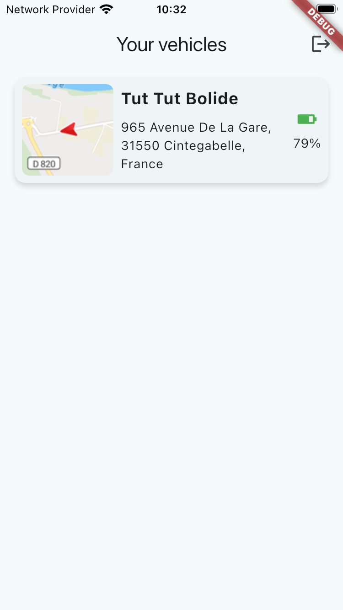
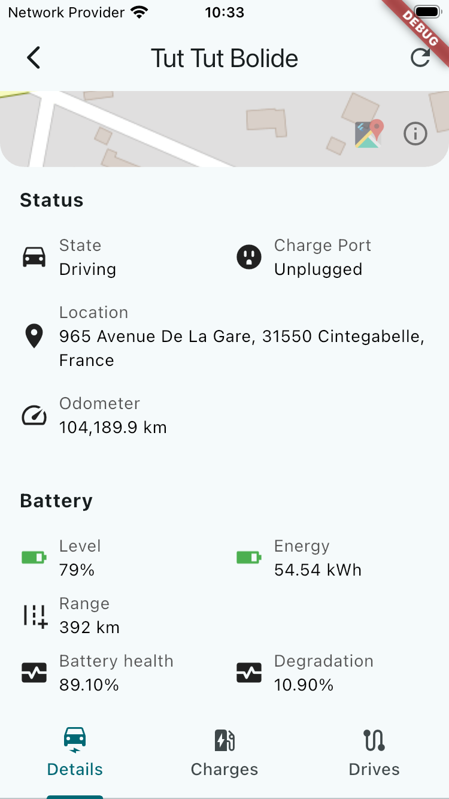
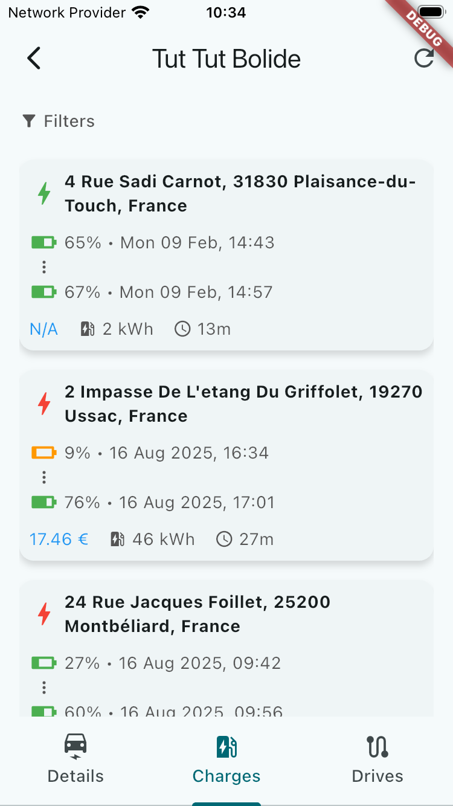
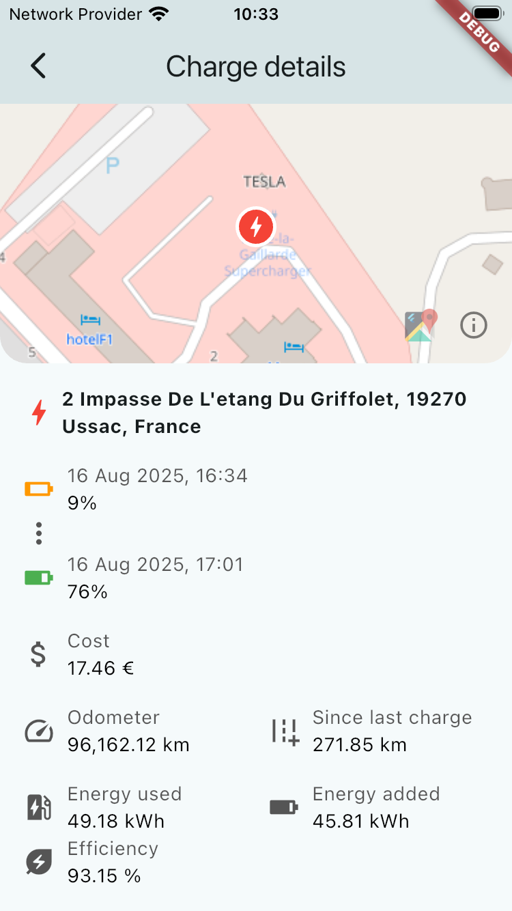
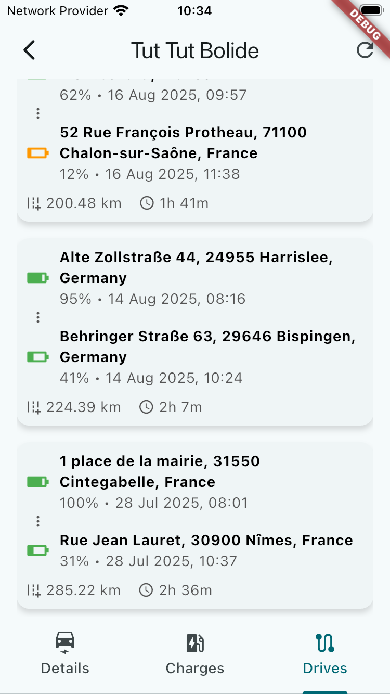
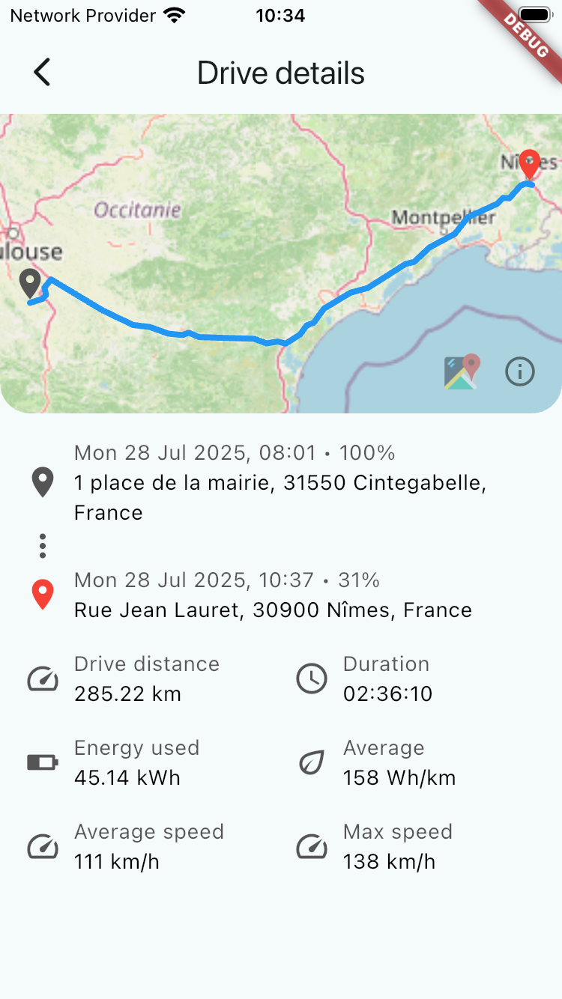

# Flussie

A Flutter app to monitor your Tesla vehicles using the [Tessie API](https://developer.tessie.com/reference/about).

> **Note:** This project is a pure technology watch exercise on Flutter. It is not intended for production use.

## Features

- **Vehicle list** — see all your vehicles at a glance with their current location and battery level
- **Vehicle details** — live map, status (state, charge port, odometer), battery info (level, range, health, degradation)
- **Charge history** — browse past charging sessions with date filters; view location, energy added, cost, and efficiency per session
- **Drive history** — browse past trips; view route on a map, distance, duration, energy used, and average/max speed
- **Demo mode** — explore the app without a Tessie token using bundled sample data

## Screenshots

| Vehicles | Details | Charges | Charge detail |
|---|---|---|---|
|  |  |  |  |

| Drives | Drive detail |
|---|---|
|  |  |

## Getting started

### Prerequisites

- Flutter SDK ≥ 3.10
- A [Tessie](https://tessie.com) account and API token — or use **demo mode** to try the app without one

### Run

```bash
flutter pub get
flutter run
```

On first launch, enter your Tessie API token. Type `demo` to run in demo mode with sample data.

## Tech stack

| | |
|---|---|
| State management | [GetX](https://pub.dev/packages/get) |
| Maps | [flutter_map](https://pub.dev/packages/flutter_map) + OpenStreetMap |
| Secure storage | [flutter_keychain](https://pub.dev/packages/flutter_keychain) |
| Localisation | EN · FR |

## License

MIT
